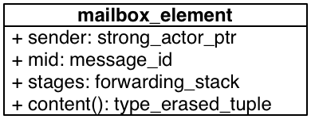

.. raw:: latex

   \definecolor{lightgrey}{rgb}{0.9,0.9,0.9}

.. raw:: latex

   \definecolor{lightblue}{rgb}{0,0,1}

.. raw:: latex

   \definecolor{grey}{rgb}{0.5,0.5,0.5}

.. raw:: latex

   \definecolor{blue}{rgb}{0,0,1}

.. raw:: latex

   \definecolor{violet}{rgb}{0.5,0,0.5}

.. raw:: latex

   \definecolor{darkred}{rgb}{0.5,0,0}

.. raw:: latex

   \definecolor{darkblue}{rgb}{0,0,0.5}

.. raw:: latex

   \definecolor{darkgreen}{rgb}{0,0.5,0}

.. _message-passing:

Message Passing
===============

Message passing in CAF is always asynchronous. Further, CAF neither guarantees message delivery nor message ordering in a distributed setting. CAF uses TCP per default, but also enables nodes to send messages to other nodes without having a direct connection. In this case, messages are forwarded by intermediate nodes and can get lost if one of the forwarding nodes fails. Likewise, forwarding paths can change dynamically and thus cause messages to arrive out of order.

The messaging layer of CAF has three primitives for sending messages: ``send``, ``request``, and ``delegate``. The former simply enqueues a message to the mailbox the receiver. The latter two are discussed in more detail in § \ `1.5 <#request>`__ and § \ `1.7 <#delegate>`__.

.. _mailbox-element:

Structure of Mailbox Elements
-----------------------------

When enqueuing a message to the mailbox of an actor, CAF wraps the content of the message into a ``mailbox_element`` (shown below) to add meta data and processing paths.

.. raw:: latex

   \centering

   UML class diagram for ``mailbox_element``

:ref:`mailbox_element`

The sender is stored as a ``strong_actor_ptr`` (see § `:ref:`actor-pointer` <#actor-pointer>`__) and denotes the origin of the message. The message ID is either 0—invalid—or a positive integer value that allows the sender to match a response to its request. The ``stages`` vector stores the path of the message. Response messages, i.e., the returned values of a message handler, are sent to ``stages.back()`` after calling ``stages.pop_back()``. This allows CAF to build pipelines of arbitrary size. If no more stage is left, the response reaches the sender. Finally, ``content()`` grants access to the type-erased tuple storing the message itself.

Mailbox elements are created by CAF automatically and are usually invisible to the programmer. However, understanding how messages are processed internally helps understanding the behavior of the message passing layer.

It is worth mentioning that CAF usually wraps the mailbox element and its content into a single object in order to reduce the number of memory allocations.

.. _copy-on-write:

Copy on Write
-------------

CAF allows multiple actors to implicitly share message contents, as long as no actor performs writes. This allows groups (see § \ `:ref:`groups` <#groups>`__) to send the same content to all subscribed actors without any copying overhead.

Actors copy message contents whenever other actors hold references to it and if one or more arguments of a message handler take a mutable reference.

.. _requirements-for-message-types:

Requirements for Message Types
------------------------------

Message types in CAF must meet the following requirements:

#. Serializable or inspectable (see § `:ref:`type-inspection` <#type-inspection>`__)

#. Default constructible

#. Copy constructible

A type is serializable if it provides free function ``serialize(Serializer&, T&)`` or ``serialize(Serializer&, T&, const unsigned int)``. Accordingly, a type is inspectable if it provides a free function ``inspect(Inspector&, T&)``.

Requirement 2 is a consequence of requirement 1, because CAF needs to be able to create an object of a type before it can call ``serialize`` or ``inspect`` on it. Requirement 3 allows CAF to implement Copy on Write (see § \ `1.2 <#copy-on-write>`__).

.. _special-handler:

Default and System Message Handlers
-----------------------------------

CAF has three system-level message types (``down_msg``, ``exit_msg``, and ``error``) that all actor should handle regardless of there current state. Consequently, event-based actors handle such messages in special-purpose message handlers. Additionally, event-based actors have a fallback handler for unmatched messages. Note that blocking actors have neither of those special-purpose handlers (see § `:ref:`blocking-actor` <#blocking-actor>`__).

.. _down-message:

Down Handler
~~~~~~~~~~~~

Actors can monitor the lifetime of other actors by calling ``self->monitor(other)``. This will cause the runtime system of CAF to send a ``down_msg`` for ``other`` if it dies. Actors drop down messages unless they provide a custom handler via ``set_down_handler(f)``, where ``f`` is a function object with signature ``void (down_msg&)`` or ``void (scheduled_actor*, down_msg&)``. The latter signature allows users to implement down message handlers as free function.

.. _exit-message:

Exit Handler
~~~~~~~~~~~~

Bidirectional monitoring with a strong lifetime coupling is established by calling ``self->link_to(other)``. This will cause the runtime to send an ``exit_msg`` if either ``this`` or ``other`` dies. Per default, actors terminate after receiving an ``exit_msg`` unless the exit reason is ``exit_reason::normal``. This mechanism propagates failure states in an actor system. Linked actors form a sub system in which an error causes all actors to fail collectively. Actors can override the default handler via ``set_exit_handler(f)``, where ``f`` is a function object with signature ``void (exit_message&)`` or ``void (scheduled_actor*, exit_message&)``.

.. _error-message:

Error Handler
~~~~~~~~~~~~~

Actors send error messages to others by returning an ``error`` (see § `:ref:`error` <#error>`__) from a message handler. Similar to exit messages, error messages usually cause the receiving actor to terminate, unless a custom handler was installed via ``set_error_handler(f)``, where ``f`` is a function object with signature ``void (error&)`` or ``void (scheduled_actor*, error&)``. Additionally, ``request`` accepts an error handler as second argument to handle errors for a particular request (see § \ `1.5.2 <#error-response>`__). The default handler is used as fallback if ``request`` is used without error handler.

.. _default-handler:

Default Handler
~~~~~~~~~~~~~~~

The default handler is called whenever the behavior of an actor did not match the input. Actors can change the default handler by calling ``set_default_handler``. The expected signature of the function object is ``result<message> (scheduled_actor*, message_view&)``, whereas the ``self`` pointer can again be omitted. The default handler can return a response message or cause the runtime to *skip* the input message to allow an actor to handle it in a later state. CAF provides the following built-in implementations: ``reflect``, ``reflect_and_quit``, ``print_and_drop``, ``drop``, and ``skip``. The former two are meant for debugging and testing purposes and allow an actor to simply return an input. The next two functions drop unexpected messages with or without printing a warning beforehand. Finally, ``skip`` leaves the input message in the mailbox. The default is ``print_and_drop``.

.. _request:

Requests
--------

A main feature of CAF is its ability to couple input and output types via the type system. For example, a ``typed_actor<replies_to<int>::with<int>>`` essentially behaves like a function. It receives a single ``int`` as input and responds with another ``int``. CAF embraces this functional take on actors by simply creating response messages from the result of message handlers. This allows CAF to match *request* to *response* messages and to provide a convenient API for this style of communication.

.. _handling-response:

Sending Requests and Handling Responses
~~~~~~~~~~~~~~~~~~~~~~~~~~~~~~~~~~~~~~~

Actors send request messages by calling ``request(receiver, timeout, content...)``. This function returns an intermediate object that allows an actor to set a one-shot handler for the response message. Event-based actors can use either ``request(...).then`` or ``request(...).await``. The former multiplexes the one-shot handler with the regular actor behavior and handles requests as they arrive. The latter suspends the regular actor behavior until all awaited responses arrive and handles requests in LIFO order. Blocking actors always use ``request(...).receive``, which blocks until the one-shot handler was called. Actors receive a ``sec::request_timeout`` (see § `:ref:`sec` <#sec>`__) error message (see § \ `1.4.3 <#error-message>`__) if a timeout occurs. Users can set the timeout to ``infinite`` for unbound operations. This is only recommended if the receiver is running locally.

In our following example, we use the simple cell actors shown below as communication endpoints.

::

    using cell = typed_actor<reacts_to<put_atom, int>,
                             replies_to<get_atom>::with<int>>;

    struct cell_state {
      int value = 0;
    };

    cell::behavior_type cell_impl(cell::stateful_pointer<cell_state> self, int x0) {
      self->state.value = x0;
      return {
        [=](put_atom, int val) {
          self->state.value = val;
        },
        [=](get_atom) {
          return self->state.value;
        }
      };
    }

The first part of the example illustrates how event-based actors can use either ``then`` or ``await``.

::

    void waiting_testee(event_based_actor* self, vector<cell> cells) {
      for (auto& x : cells)
        self->request(x, seconds(1), get_atom::value).await([=](int y) {
          aout(self) << "cell #" << x.id() << " -> " << y << endl;
        });
    }

    void multiplexed_testee(event_based_actor* self, vector<cell> cells) {
      for (auto& x : cells)
        self->request(x, seconds(1), get_atom::value).then([=](int y) {
          aout(self) << "cell #" << x.id() << " -> " << y << endl;
        });
    }

.. raw:: latex

   \clearpage

The second half of the example shows a blocking actor making use of ``receive``. Note that blocking actors have no special-purpose handler for error messages and therefore are required to pass a callback for error messages when handling response messages.

::

    void blocking_testee(blocking_actor* self, vector<cell> cells) {
      for (auto& x : cells)
        self->request(x, seconds(1), get_atom::value).receive(
          [&](int y) {
            aout(self) << "cell #" << x.id() << " -> " << y << endl;
          },
          [&](error& err) {
            aout(self) << "cell #" << x.id()
                       << " -> " << self->system().render(err) << endl;
          }
        );
    }

We spawn five cells and assign the values 0, 1, 4, 9, and 16.

::

      vector<cell> cells;
      for (auto i = 0; i < 5; ++i)
        cells.emplace_back(system.spawn(cell_impl, i * i));

When passing the ``cells`` vector to our three different implementations, we observe three outputs. Our ``waiting_testee`` actor will always print:

::

    cell #9 -> 16
    cell #8 -> 9
    cell #7 -> 4
    cell #6 -> 1
    cell #5 -> 0

This is because ``await`` puts the one-shots handlers onto a stack and enforces LIFO order by re-ordering incoming response messages.

The ``multiplexed_testee`` implementation does not print its results in a predicable order. Response messages arrive in arbitrary order and are handled immediately.

Finally, the ``blocking_testee`` implementation will always print:

::

    cell #5 -> 0
    cell #6 -> 1
    cell #7 -> 4
    cell #8 -> 9
    cell #9 -> 16

Both event-based approaches send all requests, install a series of one-shot handlers, and then return from the implementing function. In contrast, the blocking function waits for a response before sending another request.

.. raw:: latex

   \clearpage

.. _error-response:

Error Handling in Requests
~~~~~~~~~~~~~~~~~~~~~~~~~~

Requests allow CAF to unambiguously correlate request and response messages. This is also true if the response is an error message. Hence, CAF allows to add an error handler as optional second parameter to ``then`` and ``await`` (this parameter is mandatory for ``receive``). If no such handler is defined, the default error handler (see § `1.4.3 <#error-message>`__) is used as a fallback in scheduled actors.

As an example, we consider a simple divider that returns an error on a division by zero. This examples uses a custom error category (see § \ `:ref:`error` <#error>`__).

::

    enum class math_error : uint8_t {
      division_by_zero = 1
    };

    error make_error(math_error x) {
      return {static_cast<uint8_t>(x), atom("math")};
    }

    using div_atom = atom_constant<atom("div")>;

    using divider = typed_actor<replies_to<div_atom, double, double>::with<double>>;

    divider::behavior_type divider_impl() {
      return {
         -> result<double> {
          if (y == 0.0)
            return math_error::division_by_zero;
          return x / y;
        }
      };
    }

When sending requests to the divider, we use a custom error handlers to report errors to the user.

::

      scoped_actor self{system};
      self->request(div, std::chrono::seconds(10), div_atom::value, x, y).receive(
        [&](double z) {
          aout(self) << x << " / " << y << " = " << z << endl;
        },
        [&](const error& err) {
          aout(self) << "*** cannot compute " << x << " / " << y << " => "
                     << system.render(err) << endl;
        }
      );

.. raw:: latex

   \clearpage

.. _delay-message:

Delaying Messages
-----------------

Messages can be delayed by using the function ``delayed_send``, as illustrated in the following time-based loop example.

::

    // uses a message-based loop to iterate over all animation steps
    void dancing_kirby(event_based_actor* self) {
      // let's get it started
      self->send(self, step_atom::value, size_t{0});
      self->become (
        [=](step_atom, size_t step) {
          if (step == sizeof(animation_step)) {
            // we've printed all animation steps (done)
            cout << endl;
            self->quit();
            return;
          }
          // print given step
          draw_kirby(animation_steps[step]);
          // animate next step in 150ms
          self->delayed_send(self, std::chrono::milliseconds(150),
                             step_atom::value, step + 1);
        }
      );
    }

.. raw:: latex

   \clearpage

.. _delegate:

Delegating Messages
-------------------

Actors can transfer responsibility for a request by using ``delegate``. This enables the receiver of the delegated message to reply as usual—simply by returning a value from its message handler—and the original sender of the message will receive the response. The following diagram illustrates request delegation from actor B to actor C.

::

                   A                  B                  C
                   |                  |                  |
                   | ---(request)---> |                  |
                   |                  | ---(delegate)--> |
                   |                  X                  |---\
                   |                                     |   | compute
                   |                                     |   | result
                   |                                     |<--/
                   | <-------------(reply)-------------- |
                   |                                     X
                   |---\
                   |   | handle
                   |   | response
                   |<--/
                   |
                   X

Returning the result of ``delegate(...)`` from a message handler, as shown in the example below, suppresses the implicit response message and allows the compiler to check the result type when using statically typed actors.

::

    void actor_a(event_based_actor* self, const calc& worker) {
      self->request(worker, std::chrono::seconds(10), add_atom::value, 1, 2).then(
        [=](int result) {
          aout(self) << "1 + 2 = " << result << endl;
        }
      );
    }

    calc::behavior_type actor_b(calc::pointer self, const calc& worker) {
      return {
        [=](add_atom add, int x, int y) {
          return self->delegate(worker, add, x, y);
        }
      };
    }

    calc::behavior_type actor_c() {
      return {
         {
          return x + y;
        }
      };
    }

    void caf_main(actor_system& system) {
      system.spawn(actor_a, system.spawn(actor_b, system.spawn(actor_c)));
    }

.. _promise:

Response Promises
-----------------

Response promises allow an actor to send and receive other messages prior to replying to a particular request. Actors create a response promise using ``self->make_response_promise<Ts...>()``, where ``Ts`` is a template parameter pack describing the promised return type. Dynamically typed actors simply call ``self->make_response_promise()``. After retrieving a promise, an actor can fulfill it by calling the member function ``deliver(...)``, as shown in the following example.

::

    // using add_atom = atom_constant<atom("add")>; (defined in atom.hpp)

    using adder = typed_actor<replies_to<add_atom, int, int>::with<int>>;

    // function-based, statically typed, event-based API
    adder::behavior_type worker() {
      return {
         {
          return a + b;
        }
      };
    }

    // function-based, statically typed, event-based API
    adder::behavior_type calculator_master(adder::pointer self) {
      auto w = self->spawn(worker);
      return {
        [=](add_atom x, int y, int z) -> result<int> {
          auto rp = self->make_response_promise<int>();
          self->request(w, infinite, x, y, z).then([=](int result) mutable {
            rp.deliver(result);
          });
          return rp;
        }
      };
    }

.. raw:: latex

   \clearpage

.. _message-priorities:

Message Priorities
------------------

By default, all messages have the default priority, i.e., ``message_priority::normal``. Actors can send urgent messages by setting the priority explicitly: ``send<message_priority::high>(dst, ...)``. Urgent messages are put into a different queue of the receiver’s mailbox. Hence, long wait delays can be avoided for urgent communication.
