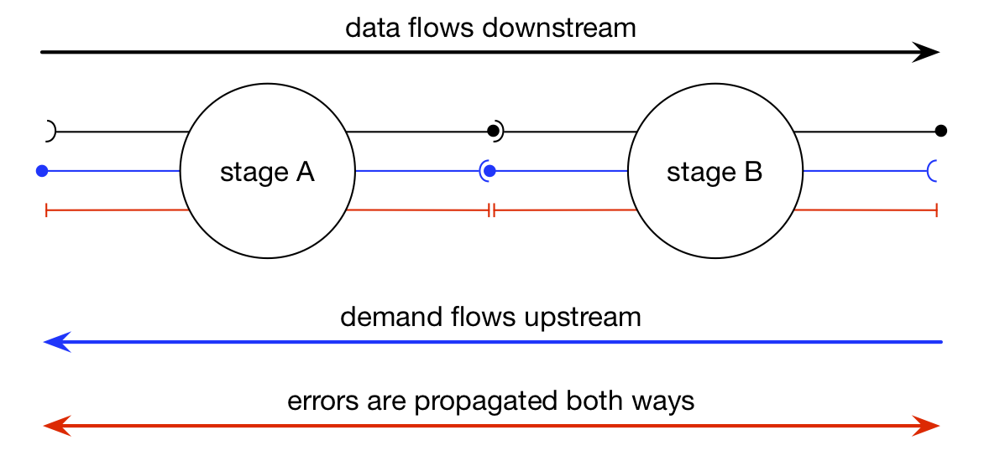
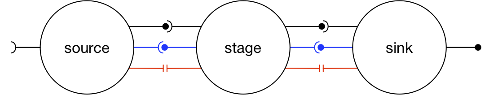
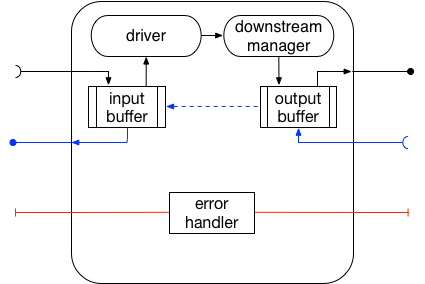

.. _streaming:

Streaming :sup:`experimental`
=============================

Streams in CAF describe data flow between actors. We are not aiming to provide
functionality similar to Apache projects like Spark, Flink or Storm. Likewise,
we have different goals than APIs such as RxJava, Reactive Streams, etc.
Streams complement asynchronous messages, request/response communication and
publish/subscribe in CAF. In a sense, actor streams in CAF are a building
block that users could leverage for building feature-complete stream
computation engines or reactive high-level Big Data APIs.

A stream establishes a logical channel between two or more actors for
exchanging a potentially unbound sequence of values. This channel uses demand
signaling to guarantee that senders cannot overload receivers.

.. _stream:

Streams are directed and data flows only *downstream*, i.e., from sender
(source) to receiver (sink). Establishing a stream requires a handshake in
order to initialize required state and signal initial demand.

.. _stream-roles:

CAF distinguishes between three roles in a stream: (1) a *source* creates
streams and generates data, (2) a *stage* transforms or filters data, and
(3) a *sink* terminates streams by consuming data.

We usually draw streams as pipelines for simplicity. However, sources can have
any number of outputs (downstream actors). Likewise, sinks can have any number
of inputs (upstream actors) and stages can multiplex N inputs to M outputs.
Hence, streaming topologies in CAF support arbitrary complexity with forks and
joins.

Stream Managers
---------------

Streaming-related messages are handled separately. Under the hood, actors
delegate to *stream managers* that in turn allow customization of their
behavior with *drivers* and *downstream managers*.

.. _fig-stream-manager:

Users usually can skip implementing driver classes and instead use the
lambda-based interface showcased in the following sections. Drivers implement
the streaming logic by taking inputs from upstream actors and pushing data to
the downstream manager. A source has no input buffer. Hence, drivers only
provide a *generator* function that downstream managers call according to
demand.

A downstream manager is responsible for dispatching data to downstream actors.
The default implementation broadcasts data, i.e., all downstream actors receive
the same data. The downstream manager can also perform any sort multi- or
anycast. For example, a load-balancer would use an anycast policy to dispatch
data to the next available worker.

Defining Sources
----------------

.. code-block:: c++

   // Simple source for generating a stream of integers from [0, n).
   behavior int_source(event_based_actor* self) {
     return {[=](open_atom, int n) {
       // Produce at least one value.
       if (n <= 0)
         n = 1;
       // Create a stream manager for implementing a stream source. The
       // streaming logic requires three functions: initializer, generator, and
       // predicate.
       return attach_stream_source(
         self,
         // Initializer. The type of the first argument (state) is freely
         // chosen. If no state is required, `caf::unit_t` can be used here.
          { x = 0; },
         // Generator. This function is called by CAF to produce new stream
         // elements for downstream actors. The `x` argument is our state again
         // (with our freely chosen type). The second argument `out` points to
         // the output buffer. The template argument (here: int) determines what
         // elements downstream actors receive in this stream. Finally, `num` is
         // a hint from CAF how many elements we should ideally insert into
         // `out`. We can always insert fewer or more items.
         [n](int& x, downstream<int>& out, size_t num) {
           auto max_x = std::min(x + static_cast<int>(num), n);
           for (; x < max_x; ++x)
             out.push(x);
         },
         // Predicate. This function tells CAF when we reached the end.
         [n](const int& x) { return x == n; });
     }};

The simplest way to defining a source is to use the
``attach_stream_source`` function and pass it four arguments: a pointer
to *self*, *initializer* for the state, *generator* for
producing values, and *predicate* for signaling the end of the stream.

Defining Stages
---------------

.. code-block:: c++

   // Simple stage that only selects even numbers.
   behavior int_selector(event_based_actor* self) {
     return {[=](stream<int> in) {
       // Create a stream manager for implementing a stream stage. Similar to
       // `make_source`, we need three functions: initialzer, processor, and
       // finalizer.
       return attach_stream_stage(
         self,
         // Our input source.
         in,
         // Initializer. Here, we don't need any state and simply use unit_t.
          {
           // nop
         },
         // Processor. This function takes individual input elements as `val`
         // and forwards even integers to `out`.
          {
           if (val % 2 == 0)
             out.push(val);
         },
         // Finalizer. Allows us to run cleanup code once the stream terminates.
         [=](unit_t&, const error& err) {
           if (err) {
             aout(self) << "int_selector aborted with error: " << err << std::endl;
           } else {
             aout(self) << "int_selector finalized" << std::endl;
           }
           // else: regular stream shutdown
         });
     }};

The function ``make_stage`` also takes three lambdas but additionally
the received input stream handshake as first argument. Instead of a predicate,
``make_stage`` only takes a finalizer, since the stage does not produce
data on its own and a stream terminates if no more sources exist.

Defining Sinks
--------------

.. code-block:: c++

   behavior int_sink(event_based_actor* self) {
     return {[=](stream<int> in) {
       // Create a stream manager for implementing a stream sink. Once more, we
       // have to provide three functions: Initializer, Consumer, Finalizer.
       return attach_stream_sink(
         self,
         // Our input source.
         in,
         // Initializer. Here, we store all values we receive. Note that streams
         // are potentially unbound, so this is usually a bad idea outside small
         // examples like this one.
          {
           // nop
         },
         // Consumer. Takes individual input elements as `val` and stores them
         // in our history.
          { xs.emplace_back(val); },
         // Finalizer. Allows us to run cleanup code once the stream terminates.
         [=](std::vector<int>& xs, const error& err) {
           if (err) {
             aout(self) << "int_sink aborted with error: " << err << std::endl;
           } else {
             aout(self) << "int_sink finalized after receiving: " << xs
                        << std::endl;
           }
         });

The function ``make_sink`` is similar to ``make_stage``, except
that is does not produce outputs.

Initiating Streams
------------------

.. code-block:: c++

     auto src = sys.spawn(int_source);
     auto snk = sys.spawn(int_sink);
     auto pipeline = cfg.with_stage ? snk * sys.spawn(int_selector) * src
                                    : snk * src;

In our example, we always have a source ``int_source`` and a sink
``int_sink`` with an optional stage ``int_selector``. Sending
``open_atom`` to the source initiates the stream and the source will
respond with a stream handshake.

Using the actor composition in CAF (``snk * src`` reads *sink
after source*) allows us to redirect the stream handshake we send in
``caf_main`` to the sink (or to the stage and then from the stage to
the sink).
